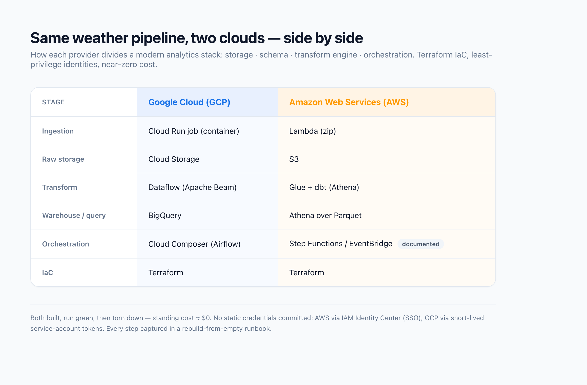
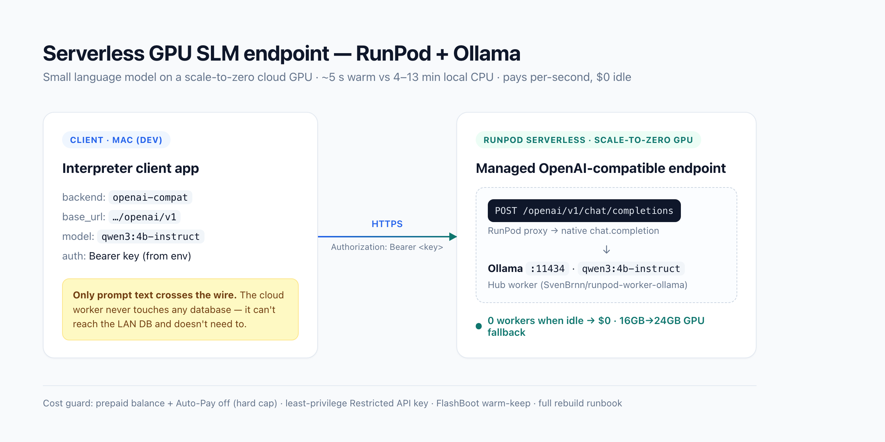

# python-data-playground — hands-on cloud engineering

Hands-on cloud builds across **data engineering** and **ML inference**: two end-to-end data
pipelines that build the *same* daily weather pipeline on two different clouds side by side,
plus a serverless GPU endpoint that serves a small language model at near-zero idle cost.

Everything is provisioned with **Terraform** (or reproducible console steps), secured with
**least-privilege** identities, and designed to run at **near-zero cost**. Each was built, run
green, and then torn down — the code here recreates the whole stack from scratch.

## The two data pipelines



*The identical pipeline on both clouds — each row is one stage, so you can read straight
across to see how GCP and AWS map the same job onto their own managed services.*

| | GCP | AWS |
|---|---|---|
| **Ingestion** | Cloud Run job (container) | Lambda (zip) |
| **Raw storage** | Cloud Storage | S3 |
| **Transform** | Dataflow (Apache Beam) | Glue + dbt (Athena) |
| **Warehouse / query** | BigQuery | Athena over Parquet |
| **Orchestration** | Cloud Composer (Airflow) | Step Functions / EventBridge (documented) |
| **IaC** | Terraform | Terraform |

- **[GCP — Cloud Run + Dataflow + BigQuery + Composer](GCP/gcp-weather-demo/README.md)**
  Complete end-to-end, including Apache Airflow orchestration. Built, run green, torn down.
- **[AWS — Lambda + S3 + Glue + Athena + dbt](AWS/aws-weather-demo/README.md)**
  Built through transform + data-quality tests (dbt); orchestration documented. Built,
  verified, torn down.

## The ML-inference build

- **[Serverless SLM endpoint — RunPod + Ollama](serverless-slm/README.md)**
  Serves a small language model (`qwen3:4b-instruct`) on a scale-to-zero cloud GPU behind an
  OpenAI-compatible API, cutting inference from minutes (local CPU) to ~5 s at sub-cent per
  request. Built, verified, with an integration handoff for a client app.



*Only prompt text crosses the wire — the cloud worker never touches a database. The endpoint
scales to zero when idle (0 cost), and the client connects through RunPod's native
OpenAI-compatible route with just a `base_url` + key change.*

Each project ships a **full step-by-step build log** — every command with the *why*, and the
real bugs hit along the way — so anyone (including future me) can rebuild it from an empty
account: [`RUNBOOK_AWS.md`](AWS/aws-weather-demo/RUNBOOK_AWS.md) ·
[`RUNBOOK_GCP.md`](GCP/gcp-weather-demo/RUNBOOK_GCP.md) ·
[`RUNBOOK_SLM.md`](serverless-slm/RUNBOOK_SLM.md). All real identifiers are replaced with
documented `<PLACEHOLDER>`s (each with a "how to obtain" note).

## Repository layout

```
GCP/gcp-weather-demo/   # Terraform, ingestion, Dataflow pipeline, DAG, SQL, README
AWS/aws-weather-demo/   # Terraform, ingestion, dbt project (models/tests), README
serverless-slm/         # RunPod serverless GPU worker (Ollama), runbook, README
```

Each project folder is self-contained: its own IaC or console runbook, application code, and
README with build + teardown instructions. Python 3.12 is pinned in `.python-version`.

## Notes on secrets & cost

- No static cloud credentials are committed. AWS uses IAM Identity Center (SSO); GCP uses
  short-lived tokens minted for service accounts; the RunPod key lives only in a local `.env`.
- Account/project identifiers and endpoint ids in committed config are placeholders — set your
  own before `terraform apply` (or before deploying the endpoint).
- Everything is torn down after each run, so standing cost is ≈ $0 (the SLM endpoint is also
  scale-to-zero, so it costs nothing while idle even before teardown).
